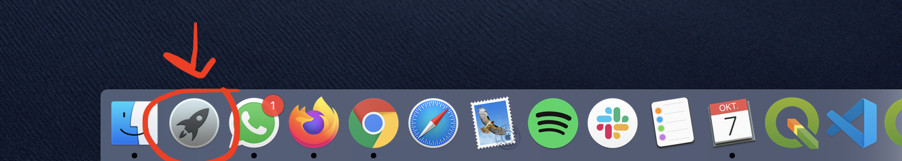
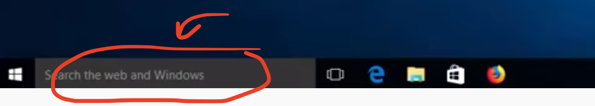
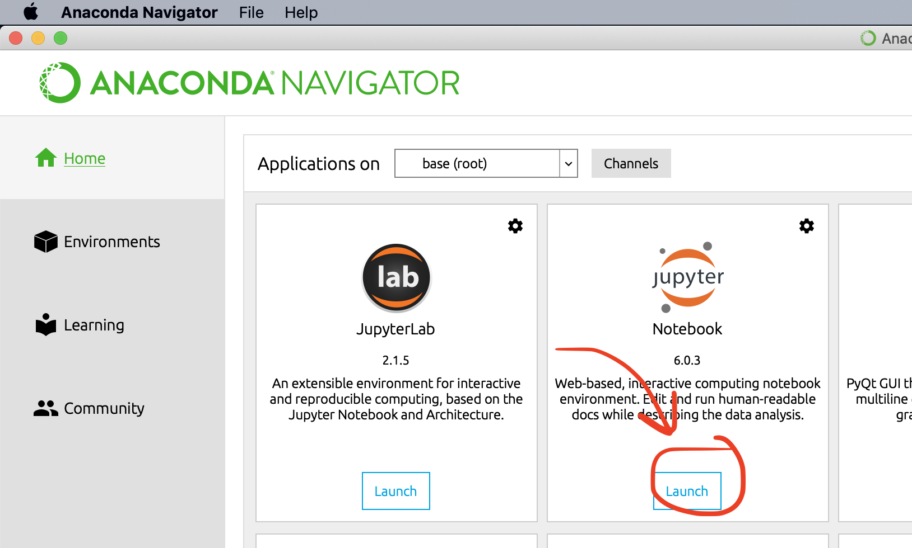
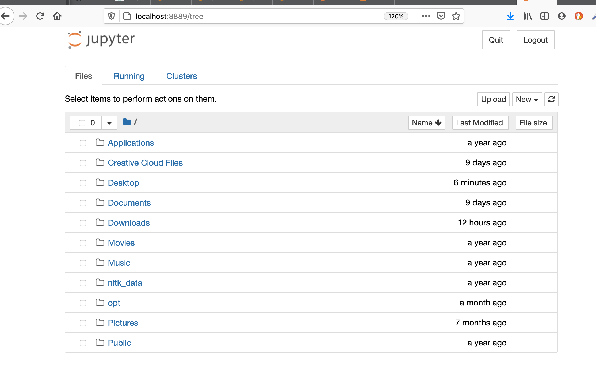
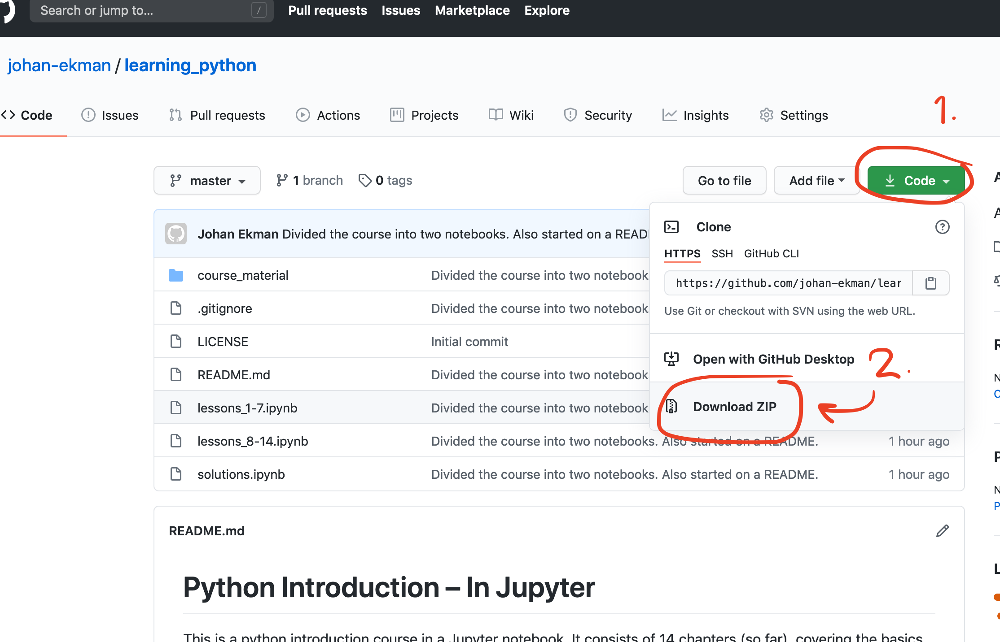
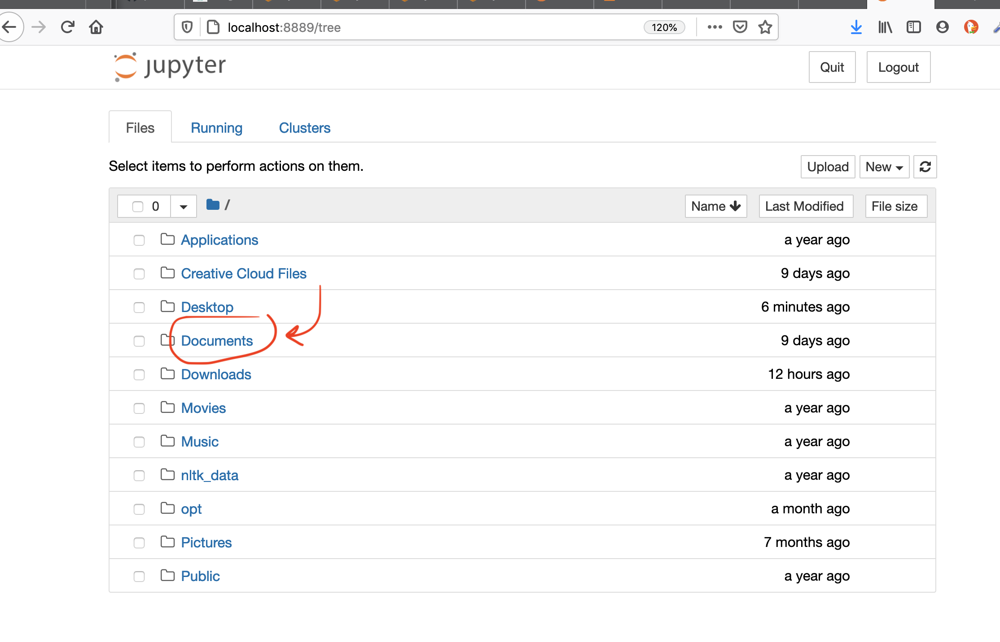
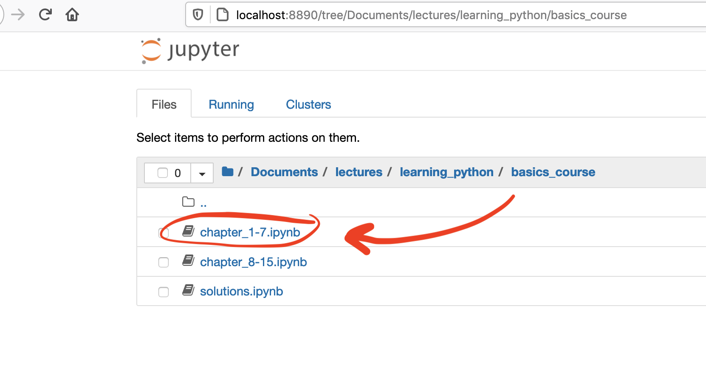
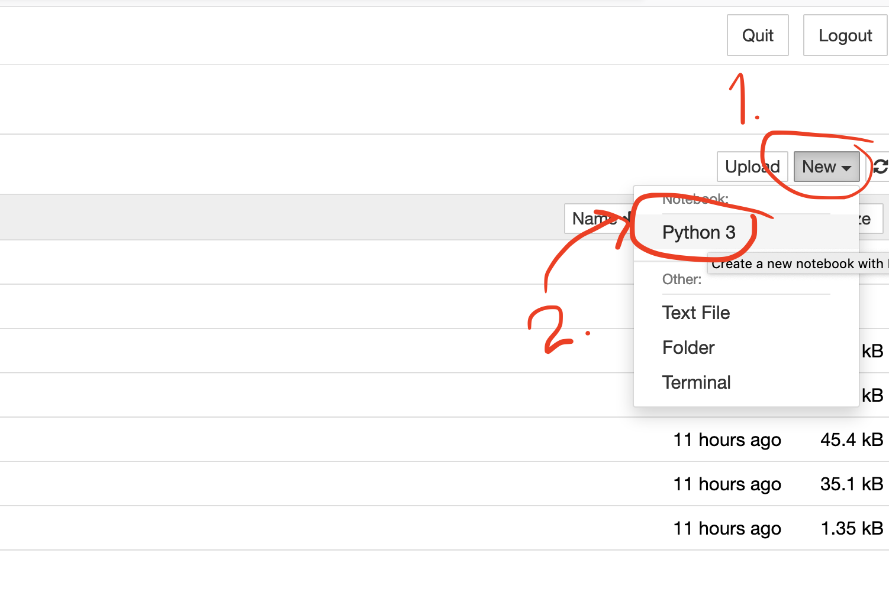
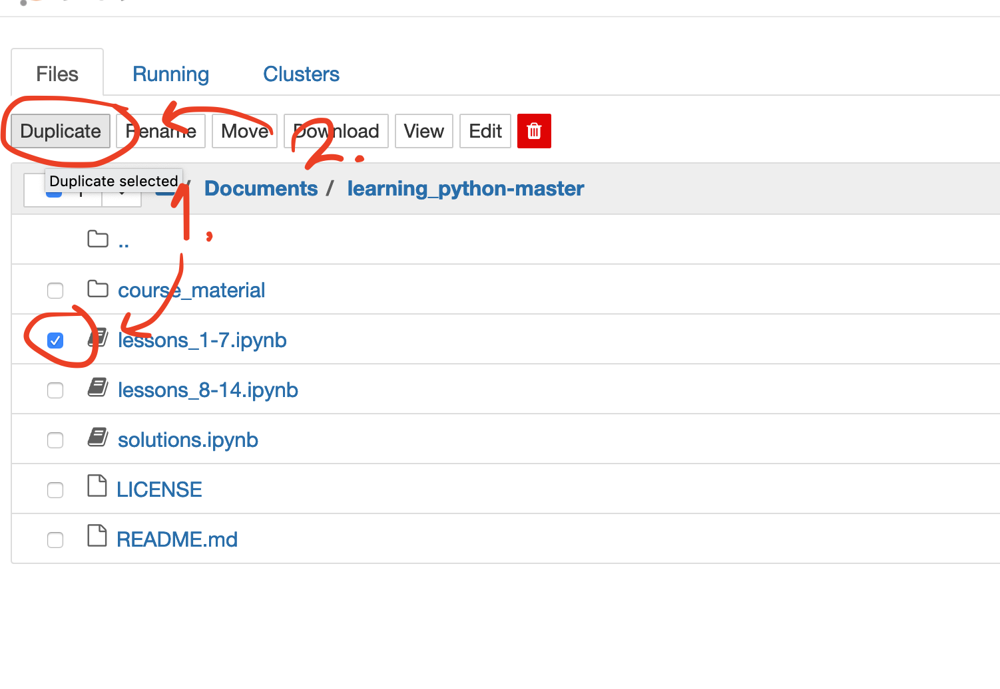

# Python Introduction – In Jupyter

This is a python introduction course in a Jupyter notebook. It consists of 14 chapters (so far), covering the basics in the python programming language. It is written for absolute beginners, with no programming skills prior taking this course. It is written in Jupyter Notebooks.

## Get started – A step-by-step guide for the beginner

### 1. Install Anaconda

The best way to quickly get into the course is to download [the Anaconda software package](https://www.anaconda.com/products/individual#Downloads). By using Anaconda, you can be sure you get all Jupyter installations needed to run the course notebook. For Max OS, you get to choose between command line installation and the graphical installer. For beginners, the graphical installer is recommended!

If you run into problems installing Anaconda, [check this guide](https://docs.anaconda.com/anaconda/install/).

When you've downloaded the Anaconda installer, open it and follow the installation instructions as recommended. The installation may take some time. Also, when installing, you will be asked if you want to install VSCode. It is a great code editor, but it is not required in this course. 

**CAUTION:** If you have installed Anaconda already, be sure to check which version of Python that was included. This course won't work with any Python version below 3.6.  

### 2. Open Anaconda Navigator

When you've successfully installed Anaconda, open the Anaconda Navigator program. In Mac, you will find it in your **launchpad** overview:

On Windows 10, you can just search for Anaconda Navigator in the **searchbar**:

### 3. Open Jupyter Notebook

The first time you open Anaconda Navigator, it can take some time to load. When it finally launches, press the Jupyter Notebook `Launch` button:

When you've pressed the launch button, your default browser will open. The first view should be your home page in the Jupyter Notebook file tree navigator. It looks like this:

### 4. Download the course material

If you are familiar with using github, then just clone this repo. If not, you can download this entire course as a zipfile by pressing these buttons on the top menu of this github page:

When you've downloaded, just unzip the file and put the folder with all material somewhere where you can find it.

### 5. Put the course folder/directory in "Documents"

Ok, it doesn't _have_ to be in the Documents directory. But, it is just that it is a common default name of a folder that can be found in both PC and Mac computers. You just need to place the course material where you can find it, in relation to your home page in the Jupyter Notebook file tree navigator (the view you get when you launch Jupyter Notebook from Anaconda). 

Place your course material here:

### 6. Open the course (part 1) in a notebook

Find the course material in the Jupyter Notebook file tree navigator interface. All Jupyter Notebook files have the file extension `.ipynb`. The first part of the course is named `lessons_1-7.ipynb`, which includes a course introduction. Start with this file:

That's it! You can now begin the course. Good luck!

## Beginner? Read this as well

As you can see in the image just above this section, all notebooks included in the course have a small book icon. There is the two parts of the actual course (the files `lessons_1-7.ipynb`and `lessons_8-14.ipynb`), and the notebook with the solutions to the course's exercises – `solutions.ipynb`. 
But I also recommend that you create your own notebook to experiment with. It's easy! You just press the `New` button up on the right and then choose "Python 3" under "Notebook" in the dropdown:

If you want to copy the course notebooks, and experiment directly in them (without risking deleting any course material), this is also possible! Just check the notebook you want to duplicate and press the "Duplicate" button up top:

