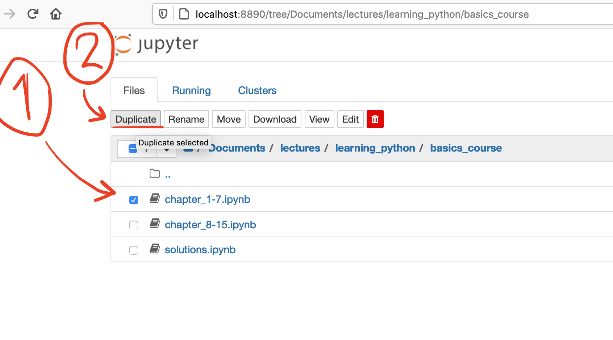

# Learning Python – In Jupyter

This is a Python introduction course in [Jupyter notebooks](https://jupyter-notebook.readthedocs.io/en/stable/notebook.html). It consists of 15 chapters of Python basics, covering the basic concepts in the Python programming language. Then, there are six more chapters in the continuation course, covering more advanced concepts and providing challenging exercises. 

The course is for absolute beginners with no prior programming skills. Therefore, the entire course is in Jupyter Notebooks, since this enables you to jump straight to trying out Python code. You won't have to worry about installing everything correctly, using virtual environments, or learning how to use your computer's interactive shell (although, you should learn about these concepts as well, later on). 

To start the course, just follow the guide below. Either by using the Anaconda Cloud service, or by downloading Anaconda to your computer and running the course on your own computer. 

__Important:__ If you use the Cloud service, please be adviced that it comes with a limit to CPU and data storage usage. This will lead to you reaching the limit at some point while doing the course. The solution when this happens is to either wait (the limit resets after a given timeframe), or to pay Anaconda to unlock your Cloud's CPU usage, or to install the Anaconda software locally on your computer. If this seems annoying, just start by downloading the course on your computer using the installation guide further down below on this page.

Good luck!

## Get started – A step-by-step guide for the beginner

The best way to quickly get into the course is to use the Anaconda software package ([follow this link](https://www.anaconda.com/products/individual#Downloads)). By using Anaconda, you can be sure you get all Jupyter installations needed to run all lessons provided in this course.

Anaconda has recently released their cloud service. This means you can do the entire course in your browser and don't have to worry about potential installation problems. This is recommended if you just want to get started quickly, since all you need is to register an account with Anaconda.

However, while using the cloud, all files you want to experiment/work with later on need to be uploaded to Anaconda's servers. Be careful not uploading sensitive stuff while using the cloud. If you want to be more in control, download the Anaconda package and install on your computer (see further down below on how to install and run the course locally on your computer).

_Disclaimer: it is not a prerequisite to use the Anaconda service to do this course. You can, of course, download the Jupyter software straight to your computer and run it as ever you see fit. Using Anaconda is simply for convenience since it comes with software used in this course already installed (the offical Jupyter documentation recommends Anaconda specifically). If you want to read more about other ways to install Jupyter, you can check out [their official documentation](https://docs.jupyter.org/en/latest/install.html#new-to-python-and-jupyter). If you are a newbie, this is not recommended._

### Do the course in the Anaconda cloud

#### 1. Create an Anaconda account

You need to create an account at [the Anaconda cloud webpage](https://anaconda.cloud/) to be able to use the service. 


[Direct link to sign up here!](https://id.anaconda.cloud/ui/registration?flow=ca5737ff-69d9-42ae-a5ef-cfa6c0f0ba0e)

#### 2. Launch a notebook

When your logged in into your Anaconda account, you should be able to press the "Launch Notebook" button beneath the "Code Online" header:


The notebook might take a while to launch, but when loaded, you should see something like this:


Important features in the launch view:
1. Upload files
2. File manager 
3. Buttons to launch notebooks. They are various versions of default notebooks.

#### 3. Download the course 

To download all files relevant for this course, first press the the `<> Code` button up top on this webpage (see (1) in this pic):


Second, download the zipfile (2). This zipfile now needs to be uploaded to the Anaconda cloud.

#### 4. Upload the course material to Anaconda Cloud

We need to upload the zipfile since it's not allowed to upload folders containing files to the Anaconda cloud (at least not when this course was last updated).

Return to the Jupyter tab you launched in step 2 above. Press the "Upload files" button up left (see (1) in picture in step 2 above) and upload the zipfile with the course material. You can also just drag and drop the zipfile into the File Manager section.

#### 5. Unzip the course material in the Anaconda Cloud

We need to use code to unzip the course material (it won't work doing it in the Jupyter File Manager, unfortunately). So let's launch a notebook. Press this button to launch a notebook:


Now, copy this code:

```py
import os
import zipfile

files = [x for x in os.listdir('.') if 'learning_python' in x]
file = [x for x in files if x.endswith('.zip')]
zf = zipfile.ZipFile(file[0], 'r')
zf.extractall('.')
zf.close()
```

...and paste it into this notebook cell:


When the code is entered into the notebook cell, press Shift + Enter. This will run the code which unzippes the zipfile. It should now have appeared in your File Manager on the left:


#### 6. (Optional) Delete the zipfile and the notebook with the unzipping code

Close the notebook with the pasted code. Now, right click on the files you want to remove in the File Manager and click "Delete":


#### 7. Open the course folder and start learning!

Double click the `learning_python` folder in the File Manager, and continue to the folder `basics_course`. Then start with the first notebook by double clicking on it (1):


Anaconda will then ask you what kernel you whish to run the notebook in, just accept the default choice by clicking "Select" (2).

And you're set! Now you can proceed with the course. Further information is provided in the course notebooks. Good luck!

### Run Anaconda locally (not in cloud)

#### 1. Install Anaconda

For Max OS, you get to choose between command line installation and the graphical installer. For beginners, the graphical installer is recommended. 

When you click on your choice of installer, you will get a pop-up window to register to Anaconda Nucleus. This service is not mandatory to run Anaconda, and it is a requirement to proceed with this course. If you don't want this service, just ignore it.

If you run into problems installing Anaconda, [check this guide](https://docs.anaconda.com/anaconda/install/).

When you've downloaded the Anaconda installer, open it and follow the installation instructions as recommended. The installation may take some time. Also, when installing, you will be asked if you want to install VSCode. It is a great code editor, but it is not required in this course. 

**CAUTION:** If you have installed Anaconda already, be sure to check which version of Python that was included. This course won't work with any Python version below 3.6.  

#### 2. Open Anaconda Navigator

When you've successfully installed Anaconda, open the Anaconda Navigator program. In Mac, you will find it in your **launchpad** overview:


On Windows 10, you can just search for Anaconda Navigator in the **searchbar**:


#### 3. Open Jupyter Notebook

The first time you open Anaconda Navigator, it can take some time to load. When it finally launches, press the Jupyter Notebook `Launch` button:


(*Windows users:*, _if a Jupyter Notebook isn't launched_ when you press launch in Ananconda Navigator, there might be a bug. If it doesn't launch properly, you can use the Anaconda prompt to launch Jupyter instead. Search for "anaconda prompt" in the Windows search bar and open it:


This will open a command line window. Here, simply type `jupyter notebook`, then press enter and it should be launched!)

When you've successfully launched Jupyter, your default browser will open. The first view should be your "home page" in the Jupyter Notebook file tree navigator. It should look similar to this:


#### 4. Download the course material

If you are familiar with using github, then just clone this repo. If not, you can download this entire course as a zipfile by pressing these buttons on the top menu of this github page:


When you've downloaded, just unzip the file and put the folder with all material somewhere where you can find it.

#### 5. Put the course folder/directory in "Documents"

Ok, it doesn't _have_ to be in the Documents directory. But, it is just that it is a common default name of a folder that can be found in both PC and Mac computers. You just need to place the course material where you can find it, in relation to your home page in the Jupyter Notebook file tree navigator (the view you get when you launch Jupyter Notebook from Anaconda). 

Place your course material here:


#### 6. Open the course in a notebook

Find the course material in the Jupyter Notebook file tree navigator interface. All Jupyter Notebook files have the file extension `.ipynb`. The course notebooks are within two different folders – one folder for Python basics and one for the continuation course. 

You start with the notebooks in the folder "basics_course". This is for the absolute beginner. The first part is named `chapter_1-7.ipynb`, which includes a course introduction. Begin with this file! In the continuation course notebook, we learn about creating and managing files, writing our own text recognition software with regular expressions, and web scraping. There is also a project assignment where you get to extract information from 5,000 pdf files! Lastly, there is a course on the data management library Pandas – highly recommended for those who want to use programming to analyze data.


That's it! You can now begin the course. Good luck! Oh, one more thing:

## Beginner? Read this as well

As you can see in the image just above this section, all notebooks included in the course have a small book icon. There is the two parts of the actual course (the files `chapter_1-7.ipynb`and `chapter_8-15.ipynb`), and the notebook with the solutions to the course's exercises – `solutions.ipynb`. 

But I also recommend that you create your own notebook to experiment with. It's easy! You just press the `New` button up on the right and then choose "Python 3" under "Notebook" in the dropdown:


If you want to copy the course notebooks, and experiment directly in them (without risking deleting any course material), this is also possible! Just check the notebook you want to duplicate and press the "Duplicate" button up top:



You can then open the new copy and work in it instead.


